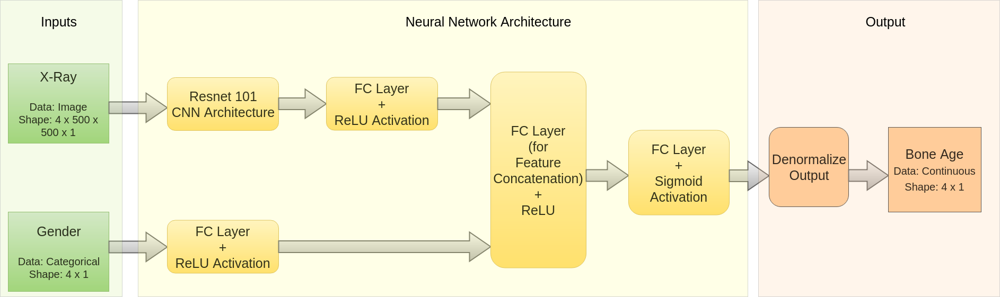

# Bone Age Predictor

## Description
Predicting Bone Age of a child when given the X-Ray Image of Hand and Gender.  
Dataset - https://www.kaggle.com/kmader/rsna-bone-age

## Neural Network Architecture  

### TO DO
Write up pending  
Upload PyTorch checkpoint to drive
