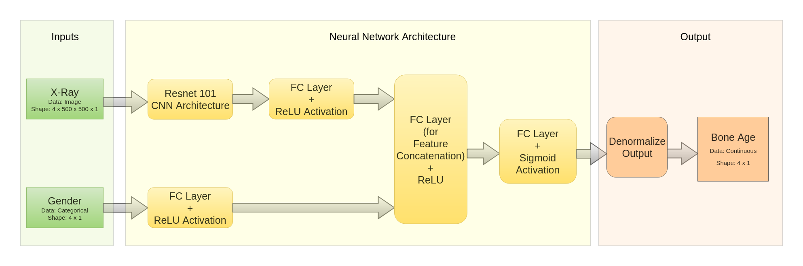

# Bone Age
Predicting Bone Age of a child when given the X-Ray Image of Hand and Gender of the Child

<!--[if IE]><meta http-equiv="X-UA-Compatible" content="IE=5,IE=9" ><![endif]-->
<!DOCTYPE html>
<html>
<head>
<title>BoneAge</title>
<meta charset="utf-8"/>
</head>
<body>

</body>
</html>
