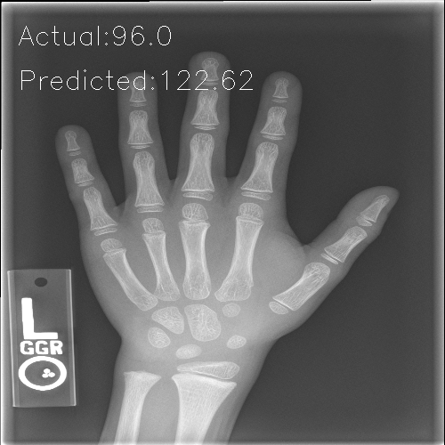

# Bone Age Predictor

## Description
The aim of this project is to predict Bone Age (in months) from the X-Ray and Gender. 
Dataset - https://www.kaggle.com/kmader/rsna-bone-age

## Neural Network Architecture 

## Motivation
This project was chosen as it is unique in following ways:
1. Image data as well as categorical data is provided and hence will require custom model.
2. Unlike most image recognition problem, the target variable is continuous and input image has only single channel.
3. Since the ouput is continuous, the network can predict negative values (whereas age can only be positive).

## Result
Predictions on the test set can be seen below

